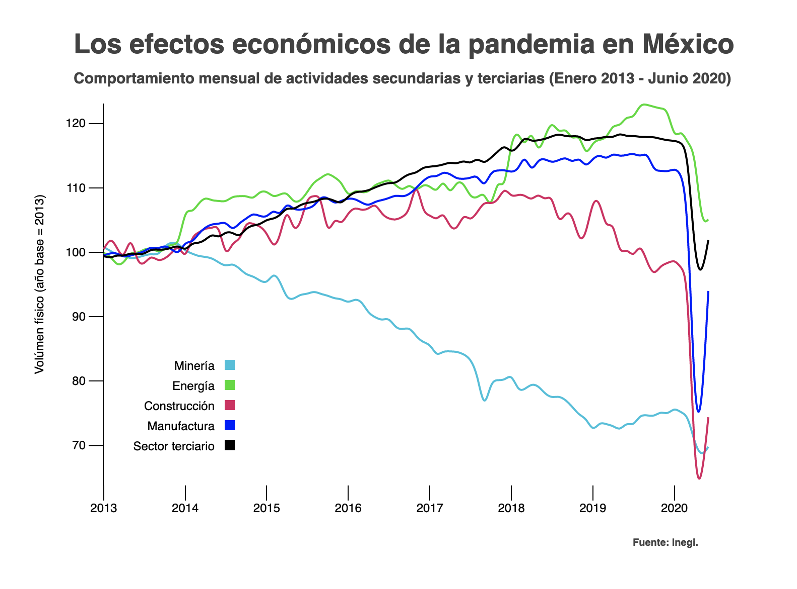

# Los efectos económicos de la pandemia en México
## #Economy #D3

This animated visualization displays the monthly physical volume of production of the secondary and tertiary sectors 
between January 2013 and June 2020. The visualization was built with D3 library and JavaScript, and it is displayed in an HTML. 
Python 3.7.6 was used to process the dataset. The data was extracted from Inegi.

Check out the animation at: https://svaldess.github.io/economia_mexico/

